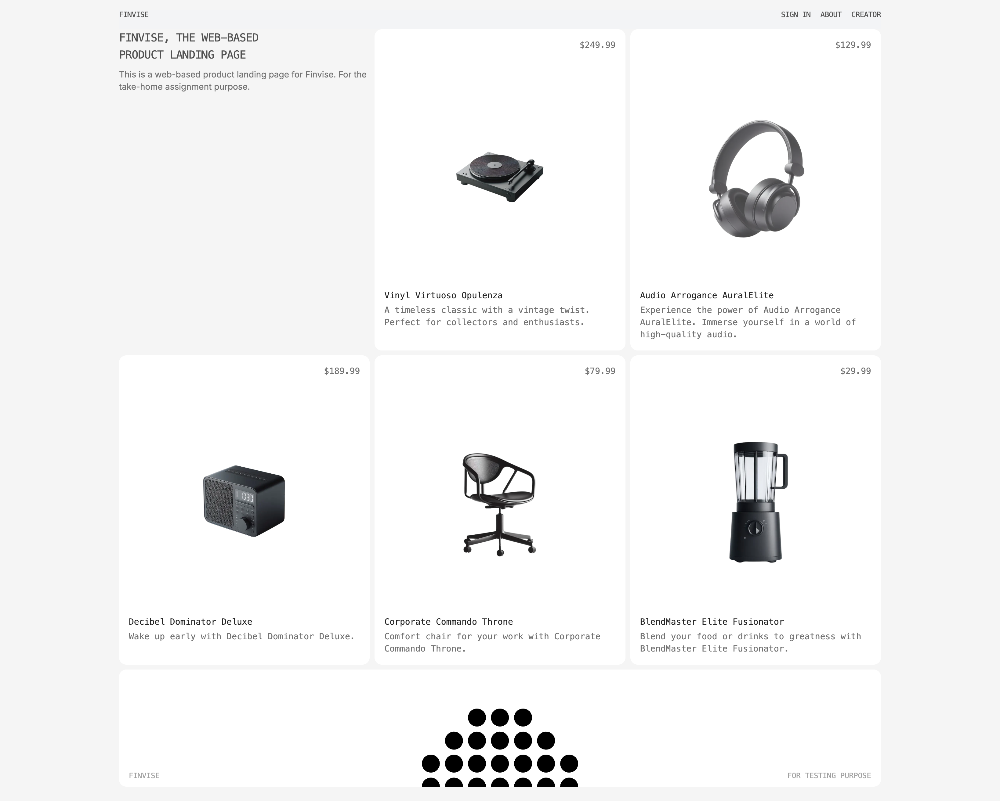

# Finvise Product Listing Page

A modern product landing page built with React, TypeScript, and Tailwind CSS. This project showcases a scalable and user-friendly product listing platform with authentication features.

## Screenshot



## About

This is a technical assessment project that demonstrates a web-based product listing platform. It features a modern UI, secure authentication, and responsive design to provide an optimal shopping experience across all devices.

## Features

- 🛍️ Product listing and detail views
- 🔒 Secure authentication system
- 🎨 Modern UI with Tailwind CSS
- 📱 Fully responsive design
- ⚡ Fast page loads with SWR
- 🔄 Server-side rendering support
- 🛠️ TypeScript for type safety
- 🔍 Product search and filtering
- 🎯 Form validation with React Hook Form

## Tech Stack

- React + TypeScript
- React Router v7
- Tailwind CSS
- SWR for data fetching
- React Hook Form
- Axios
- Vite
- Vitest for testing

## Getting Started

### Prerequisites

- Node.js 20.x or later
- npm or yarn

### Installation

1. Clone the repository
2. Install dependencies:
```bash
npm install
```
3. Copy the .env.example file to .env and set your environment variables
```bash
cp .env.example .env
```
4. There are two .env values that you need to set:
```bash
VITE_API_BASE_URL=<fill-with-your-service-url>
VITE_API_VERSION=<fill-with-your-service-version>
```
5. Start the development server:
```bash
npm run dev
```
6. Open the app in your browser at e app in your browser at http://localhost:5173
7. Enjoy!

### How to build
Just run this command and you will get the build in the dist folder
```bash
npm run build
npm run serve # since it's static site we can use serve
```
